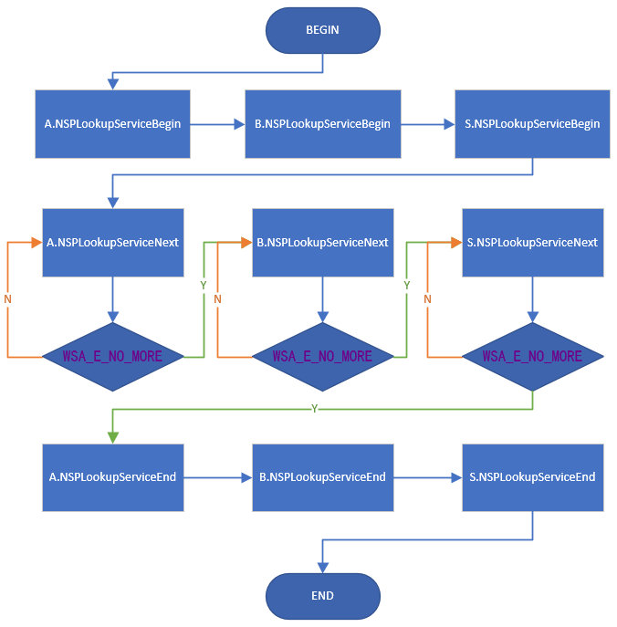

## 说明

- 实现gethostbyname、getaddrinfo返回虚拟IP

  （系统ping用的getaddrinfo）

- 支持32、64位程序

- 支持包括XP以上系统

## 编译

vs2015_xp

## 使用

TestNSP(64).exe里对`aaaa.kaho.tv`用GetHostByName解析了IPv4，用GetAddrInfo解析了IPv4和IPv6。

此域名正常结果应该是

```
C:\Users\admin>nslookup aaaa.kaho.tv
服务器:  public1.114dns.com
Address:  114.114.114.114

非权威应答:
名称:    aaaa.kaho.tv
Addresses:  2a00:8642:1000:1::3
          47.56.236.129
```

用以下步骤测试NSP劫持效果

1、管理员权限启动`install(64).exe`，并输入`1`进行安装FakeNSP。

2、安装成功后，打开TestNSP(64).exe，输入任意键，会展示Fake IP。


## gethostbyname

不需要特殊处理，只要自己的NSP排在第一并正常返回，就不会再调用系统NSP。

## getaddrinfo

对于**getaddrinfo**函数，会按顺序调用所有**NSP**，最后会把系统**NSP**的结果排到第一位。

假设有顺序的A、B、S三个NSP，其中S为系统**NSP**，**NSP**调用顺序如下：




## Proxifier处理NSP顺序

从上图可以看出，同一套参数按顺序调用了所有的**NSP**的`NSPLookupServiceBegin`。

**Proxifier**的处理办法是先把自己排在第一个**NSP**，再在`NSPLookupServiceBegin`里修改`dwNameSpace`字段：

```c++
int WSPAPI NSPLookupServiceBegin(
	LPGUID					inProviderID,
	LPWSAQUERYSETW			inQuerySet,
	LPWSASERVICECLASSINFOW	inServiceClassInfo,
	DWORD					inFlags,
	LPHANDLE				outLookup)
{
  ...
  inQuerySet->dwNameSpace = NS_TCPIP_HOSTS;		//修改dwNameSpace，防止后续NSP调用
  ...
}
```

这样当轮到系统NSP时，它会发现不是NS_DNS或者NS_ALL，就选择不解析，以此跳过了系统DNS解析。

## fakensp处理NSP顺序

由于最开始并不知道**Proxifier**的方法，我在查看**reactOS**相关代码后发现此方法可以**强制切断**对下一个**NSP**的``NSPLookupServiceNext``调用

```c++
int WSPAPI NSPLookupServiceNext(
	HANDLE			inLookup,
	DWORD			inFlags,
	LPDWORD			ioSize,
	LPWSAQUERYSETW	outResults)
{
	...
	NSQUERY* pNsQuery = Util::SpiScanNsQuery(5);	//扫描出上层函数传入的NSQUERY*参数
	if (pNsQuery != NULL)
	{
		pNsQuery->ActiveProvider = NULL;
	}
	...
}
```

## 参考

- mDNSResponder-878.70.2

  https://opensource.apple.com/tarballs/mDNSResponder/

- PaperAirplane

  https://github.com/liulilittle/PaperAirplane

- ReactOS

  https://github.com/mirror/reactos